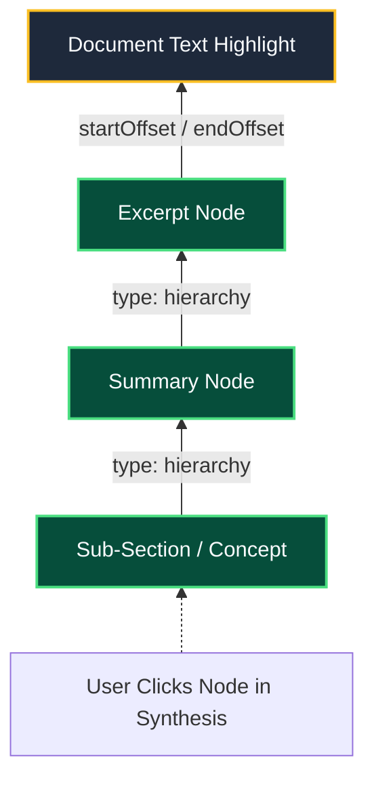
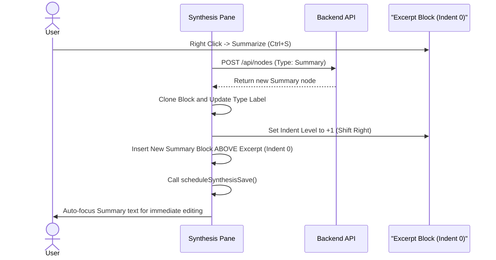

# Project: Internalize (Spatial Knowledge Engine)

## Core Philosophy & Goals

Internalize is a Personal Knowledge Management (PKM) application designed to bridge the gap between Sensemaking (reading/extracting) and Synthesis (writing/outlining). The primary goal is to maintain absolute data provenance. A user must be able to click a highly synthesized summary in their outline and trace it visually and chronologically all the way back to the original highlight in the source text.

## Architectural Layout

The UI is a dark-themed, 3-pane spatial workspace tailored for desktop usage.

* **View 1: Source Document (Left)** — Renders the raw text (e.g., articles, books) with physical highlight spans (`.excerpt-highlight`).
* **View 2: Source Tree (Center)** — A columnar view acting as the extraction inbox. Column 1 holds raw Excerpts. Column 2 holds Summaries.
* **View 3: Synthesis Workspace (Right)** — A spatial canvas/outliner where nodes are dragged, dropped, indented, and edited in place.

### Spatial UI & Workflow

How data transforms as it moves from left to right across the three panes:

```mermaid
graph LR
    subgraph sourceDoc ["Pane 1: Source Document"]
        A[Raw Text] -->|Highlight| B(Yellow Span)
    end

    subgraph sourceTree ["Pane 2: Source Tree"]
        B -. Extract .-> C["Column 1: Excerpt Node"]
        C -. Compress .-> D["Column 2: Summary Node"]
    end

    subgraph synthesis ["Pane 3: Synthesis Workspace"]
        C -. Drag & Drop .-> E{Outliner Block}
        D -. Drag & Drop .-> E
        E -->|Group & Indent| F["Prose Structure / Chapter"]
    end

    classDef p1 fill:#0f172a,stroke:#334155
    classDef p2 fill:#1e293b,stroke:#475569
    classDef p3 fill:#0f172a,stroke:#3b82f6,stroke-width:2px
    class A,B p1
    class C,D p2
    class E,F p3
```

## Data Model

The system uses a graph database approach (Nodes and Edges) mapped to the DOM.

* **Nodes** possess a strict ontology: Excerpt, Summary, Concept, and Prose Structures (Chapter, Part).
* Nodes track spatial visual state via DOM attributes: `data-indent-level`, `data-density-level`, and `data-node-id`.
* **Edges** track relationships in `ConnectionManager.edges`: 
    * Hierarchy: `SUMMARIZES`, `CONTAINS` (parent/child provenance; drawn green)
    * Logical naming: `DEFINITION_OF` (short name → longer passage; drawn amber on focus)
    * Other lateral types stay badge/Board territory until drawn explicitly.
* **Excerpt anchoring** uses `start_offset` / `end_offset` on source text (not naive string matching).

### Provenance & Deep Trace

Graph relationships that `traceNodeLineage` follows to climb from a synthesis node back to the source highlight:

### Future Horizons: Multi-Modal & Multiplayer Data (Upcoming Schema)

While the current ontology dictates strict visual DOM tracking (indent levels, density) and text offsets[cite: 2], the data model is expanding to support parallel sensemaking and collaborative environments. 

* **Multi-Modal Properties:** Nodes will soon require expanded metadata properties to support dynamic visualizations outside the columnar tree view.
    * `temporal_data`: Start/end dates for automatic plotting on Timeline views.
    * `spatial_data`: Location tags for Matrix mapping.
    * `quantitative_data`: Numeric values extracted from text to drive live-updating charts (e.g., GDP growth, casualty figures).
* **Multiplayer Provenance:** The `ConnectionManager` edges[cite: 2] will evolve to track not just `type: 'hierarchy'` or `type: 'lateral'`, but also the `author_id` and `validation_score`. This introduces edge weighting, where connections upvoted by verified community members pull nodes closer together in spatial views.
* **The Spoken Layer:** Nodes will support an `audio_reference_url` pointing to a cloud bucket, allowing users to crowdsource the narration of un-narrated summaries and excerpts.

## Core UX Mechanics (The Engine)

### Spatial Drag and Drop

Nodes can be dragged from the Source Tree into the Synthesis Workspace. An injection indicator calculates the precise Y-coordinate drop point and inherits the visual indentation of the surrounding blocks.

### In-Place Progressive Summarization

Triggering a summary (via shortcut or right-click) instantly generates a child node, pushes the original excerpt down/right in the visual hierarchy, and highlights the text for immediate elision editing.

**Ctrl+S / Summarize flow** — DOM manipulation sequence for the "Summarize in Place" mechanic:

### Multi-Select

Industry-standard DOM tracking: Ctrl+Click toggles individual nodes; Shift+Click selects a contiguous range; Tab indents entire selected groups simultaneously.

### Deep Trace Back-Propagation

Clicking any node in the Synthesis pane triggers a recursive function that climbs the hierarchical graph and illuminates ancestor cards, ultimately smooth-scrolling the Source Document to the exact origin text. See **Provenance & Deep Trace** under Data Model.

## Current Technical Priorities

* Refactoring text extraction to use precise DOM offset anchoring (`startOffset` / `endOffset`) instead of naive string matching to prevent duplicate string targeting.
* Hardening the `traceNodeLineage` engine to strictly prioritize database graph edges (`type: 'hierarchy'`) over visual DOM indentation to ensure true data provenance.